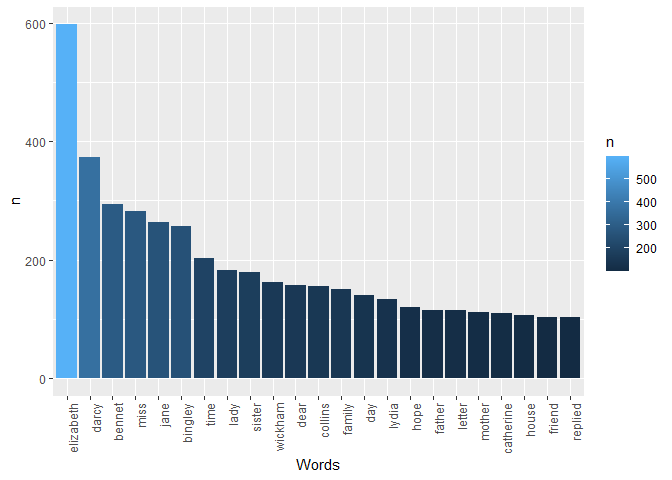

Exercise 1
================
Torin
2023-12-05

This exercise will make a barplot of the counts of the most common words
in the `prideprejudice` dataset from the `janeaustenr` package.

*Setup*

*Load required packages*

``` r
library(tidyverse)
```

    ## ── Attaching packages ─────────────────────────────────────── tidyverse 1.3.1 ──

    ## ✔ ggplot2 3.4.2     ✔ purrr   1.0.1
    ## ✔ tibble  3.2.1     ✔ dplyr   1.1.3
    ## ✔ tidyr   1.3.0     ✔ stringr 1.5.0
    ## ✔ readr   2.1.2     ✔ forcats 0.5.1

    ## Warning: package 'ggplot2' was built under R version 4.2.3

    ## Warning: package 'tibble' was built under R version 4.2.3

    ## Warning: package 'tidyr' was built under R version 4.2.3

    ## Warning: package 'purrr' was built under R version 4.2.3

    ## Warning: package 'dplyr' was built under R version 4.2.3

    ## Warning: package 'stringr' was built under R version 4.2.3

    ## ── Conflicts ────────────────────────────────────────── tidyverse_conflicts() ──
    ## ✖ dplyr::filter() masks stats::filter()
    ## ✖ dplyr::lag()    masks stats::lag()

``` r
library(janeaustenr)
```

    ## Warning: package 'janeaustenr' was built under R version 4.2.3

``` r
library(tidytext)
```

    ## Warning: package 'tidytext' was built under R version 4.2.3

``` r
#Make a data frame storing each line of text as a row
df <- tibble(prideprejudice)
df
```

    ## # A tibble: 13,030 × 1
    ##    prideprejudice                                                           
    ##    <chr>                                                                    
    ##  1 "PRIDE AND PREJUDICE"                                                    
    ##  2 ""                                                                       
    ##  3 "By Jane Austen"                                                         
    ##  4 ""                                                                       
    ##  5 ""                                                                       
    ##  6 ""                                                                       
    ##  7 "Chapter 1"                                                              
    ##  8 ""                                                                       
    ##  9 ""                                                                       
    ## 10 "It is a truth universally acknowledged, that a single man in possession"
    ## # ℹ 13,020 more rows

``` r
#Using the tidytext::unnest_tokens function, parse text into individual words and store each word in a new column named 'Words'
words <- df %>%
  unnest_tokens(output = Words, input = prideprejudice)

#Select stop words using the tidytext package (https://cran.r-project.org/web/packages/tidytext/index.html) 'stop_words' list
stopwords <- stop_words %>%
  select(Words = word)

#Remove selected stop words by joining the two tibbles via anti-join, discarding all words with a match in the 'stopwords' tibble

clean_words <- anti_join(words, stopwords)
```

    ## Joining with `by = join_by(Words)`

``` r
#Obtain count of each word
clean_words <- clean_words %>%
  count(Words, sort = TRUE)

#There are too many words to graph - filter for words appearing >50 times in the text:

clean_words <- clean_words %>%
  filter(n > 100) %>%
  mutate(Words = reorder(Words, 1/n))

clean_words
```

    ## # A tibble: 23 × 2
    ##    Words         n
    ##    <fct>     <int>
    ##  1 elizabeth   597
    ##  2 darcy       373
    ##  3 bennet      294
    ##  4 miss        283
    ##  5 jane        264
    ##  6 bingley     257
    ##  7 time        203
    ##  8 lady        183
    ##  9 sister      180
    ## 10 wickham     162
    ## # ℹ 13 more rows

``` r
#Graph the clean_words dataset
ggplot(data = clean_words) + 
  geom_col(aes(x = Words, y = n, fill = n)) +
  theme(axis.text.x = element_text(angle = 90, hjust = 1))
```

<!-- -->

``` r
  theme_light()
```

    ## List of 97
    ##  $ line                      :List of 6
    ##   ..$ colour       : chr "black"
    ##   ..$ linewidth    : num 0.5
    ##   ..$ linetype     : num 1
    ##   ..$ lineend      : chr "butt"
    ##   ..$ arrow        : logi FALSE
    ##   ..$ inherit.blank: logi TRUE
    ##   ..- attr(*, "class")= chr [1:2] "element_line" "element"
    ##  $ rect                      :List of 5
    ##   ..$ fill         : chr "white"
    ##   ..$ colour       : chr "black"
    ##   ..$ linewidth    : num 0.5
    ##   ..$ linetype     : num 1
    ##   ..$ inherit.blank: logi TRUE
    ##   ..- attr(*, "class")= chr [1:2] "element_rect" "element"
    ##  $ text                      :List of 11
    ##   ..$ family       : chr ""
    ##   ..$ face         : chr "plain"
    ##   ..$ colour       : chr "black"
    ##   ..$ size         : num 11
    ##   ..$ hjust        : num 0.5
    ##   ..$ vjust        : num 0.5
    ##   ..$ angle        : num 0
    ##   ..$ lineheight   : num 0.9
    ##   ..$ margin       : 'margin' num [1:4] 0points 0points 0points 0points
    ##   .. ..- attr(*, "unit")= int 8
    ##   ..$ debug        : logi FALSE
    ##   ..$ inherit.blank: logi TRUE
    ##   ..- attr(*, "class")= chr [1:2] "element_text" "element"
    ##  $ title                     : NULL
    ##  $ aspect.ratio              : NULL
    ##  $ axis.title                : NULL
    ##  $ axis.title.x              :List of 11
    ##   ..$ family       : NULL
    ##   ..$ face         : NULL
    ##   ..$ colour       : NULL
    ##   ..$ size         : NULL
    ##   ..$ hjust        : NULL
    ##   ..$ vjust        : num 1
    ##   ..$ angle        : NULL
    ##   ..$ lineheight   : NULL
    ##   ..$ margin       : 'margin' num [1:4] 2.75points 0points 0points 0points
    ##   .. ..- attr(*, "unit")= int 8
    ##   ..$ debug        : NULL
    ##   ..$ inherit.blank: logi TRUE
    ##   ..- attr(*, "class")= chr [1:2] "element_text" "element"
    ##  $ axis.title.x.top          :List of 11
    ##   ..$ family       : NULL
    ##   ..$ face         : NULL
    ##   ..$ colour       : NULL
    ##   ..$ size         : NULL
    ##   ..$ hjust        : NULL
    ##   ..$ vjust        : num 0
    ##   ..$ angle        : NULL
    ##   ..$ lineheight   : NULL
    ##   ..$ margin       : 'margin' num [1:4] 0points 0points 2.75points 0points
    ##   .. ..- attr(*, "unit")= int 8
    ##   ..$ debug        : NULL
    ##   ..$ inherit.blank: logi TRUE
    ##   ..- attr(*, "class")= chr [1:2] "element_text" "element"
    ##  $ axis.title.x.bottom       : NULL
    ##  $ axis.title.y              :List of 11
    ##   ..$ family       : NULL
    ##   ..$ face         : NULL
    ##   ..$ colour       : NULL
    ##   ..$ size         : NULL
    ##   ..$ hjust        : NULL
    ##   ..$ vjust        : num 1
    ##   ..$ angle        : num 90
    ##   ..$ lineheight   : NULL
    ##   ..$ margin       : 'margin' num [1:4] 0points 2.75points 0points 0points
    ##   .. ..- attr(*, "unit")= int 8
    ##   ..$ debug        : NULL
    ##   ..$ inherit.blank: logi TRUE
    ##   ..- attr(*, "class")= chr [1:2] "element_text" "element"
    ##  $ axis.title.y.left         : NULL
    ##  $ axis.title.y.right        :List of 11
    ##   ..$ family       : NULL
    ##   ..$ face         : NULL
    ##   ..$ colour       : NULL
    ##   ..$ size         : NULL
    ##   ..$ hjust        : NULL
    ##   ..$ vjust        : num 0
    ##   ..$ angle        : num -90
    ##   ..$ lineheight   : NULL
    ##   ..$ margin       : 'margin' num [1:4] 0points 0points 0points 2.75points
    ##   .. ..- attr(*, "unit")= int 8
    ##   ..$ debug        : NULL
    ##   ..$ inherit.blank: logi TRUE
    ##   ..- attr(*, "class")= chr [1:2] "element_text" "element"
    ##  $ axis.text                 :List of 11
    ##   ..$ family       : NULL
    ##   ..$ face         : NULL
    ##   ..$ colour       : chr "grey30"
    ##   ..$ size         : 'rel' num 0.8
    ##   ..$ hjust        : NULL
    ##   ..$ vjust        : NULL
    ##   ..$ angle        : NULL
    ##   ..$ lineheight   : NULL
    ##   ..$ margin       : NULL
    ##   ..$ debug        : NULL
    ##   ..$ inherit.blank: logi TRUE
    ##   ..- attr(*, "class")= chr [1:2] "element_text" "element"
    ##  $ axis.text.x               :List of 11
    ##   ..$ family       : NULL
    ##   ..$ face         : NULL
    ##   ..$ colour       : NULL
    ##   ..$ size         : NULL
    ##   ..$ hjust        : NULL
    ##   ..$ vjust        : num 1
    ##   ..$ angle        : NULL
    ##   ..$ lineheight   : NULL
    ##   ..$ margin       : 'margin' num [1:4] 2.2points 0points 0points 0points
    ##   .. ..- attr(*, "unit")= int 8
    ##   ..$ debug        : NULL
    ##   ..$ inherit.blank: logi TRUE
    ##   ..- attr(*, "class")= chr [1:2] "element_text" "element"
    ##  $ axis.text.x.top           :List of 11
    ##   ..$ family       : NULL
    ##   ..$ face         : NULL
    ##   ..$ colour       : NULL
    ##   ..$ size         : NULL
    ##   ..$ hjust        : NULL
    ##   ..$ vjust        : num 0
    ##   ..$ angle        : NULL
    ##   ..$ lineheight   : NULL
    ##   ..$ margin       : 'margin' num [1:4] 0points 0points 2.2points 0points
    ##   .. ..- attr(*, "unit")= int 8
    ##   ..$ debug        : NULL
    ##   ..$ inherit.blank: logi TRUE
    ##   ..- attr(*, "class")= chr [1:2] "element_text" "element"
    ##  $ axis.text.x.bottom        : NULL
    ##  $ axis.text.y               :List of 11
    ##   ..$ family       : NULL
    ##   ..$ face         : NULL
    ##   ..$ colour       : NULL
    ##   ..$ size         : NULL
    ##   ..$ hjust        : num 1
    ##   ..$ vjust        : NULL
    ##   ..$ angle        : NULL
    ##   ..$ lineheight   : NULL
    ##   ..$ margin       : 'margin' num [1:4] 0points 2.2points 0points 0points
    ##   .. ..- attr(*, "unit")= int 8
    ##   ..$ debug        : NULL
    ##   ..$ inherit.blank: logi TRUE
    ##   ..- attr(*, "class")= chr [1:2] "element_text" "element"
    ##  $ axis.text.y.left          : NULL
    ##  $ axis.text.y.right         :List of 11
    ##   ..$ family       : NULL
    ##   ..$ face         : NULL
    ##   ..$ colour       : NULL
    ##   ..$ size         : NULL
    ##   ..$ hjust        : num 0
    ##   ..$ vjust        : NULL
    ##   ..$ angle        : NULL
    ##   ..$ lineheight   : NULL
    ##   ..$ margin       : 'margin' num [1:4] 0points 0points 0points 2.2points
    ##   .. ..- attr(*, "unit")= int 8
    ##   ..$ debug        : NULL
    ##   ..$ inherit.blank: logi TRUE
    ##   ..- attr(*, "class")= chr [1:2] "element_text" "element"
    ##  $ axis.ticks                :List of 6
    ##   ..$ colour       : chr "grey70"
    ##   ..$ linewidth    : 'rel' num 0.5
    ##   ..$ linetype     : NULL
    ##   ..$ lineend      : NULL
    ##   ..$ arrow        : logi FALSE
    ##   ..$ inherit.blank: logi TRUE
    ##   ..- attr(*, "class")= chr [1:2] "element_line" "element"
    ##  $ axis.ticks.x              : NULL
    ##  $ axis.ticks.x.top          : NULL
    ##  $ axis.ticks.x.bottom       : NULL
    ##  $ axis.ticks.y              : NULL
    ##  $ axis.ticks.y.left         : NULL
    ##  $ axis.ticks.y.right        : NULL
    ##  $ axis.ticks.length         : 'simpleUnit' num 2.75points
    ##   ..- attr(*, "unit")= int 8
    ##  $ axis.ticks.length.x       : NULL
    ##  $ axis.ticks.length.x.top   : NULL
    ##  $ axis.ticks.length.x.bottom: NULL
    ##  $ axis.ticks.length.y       : NULL
    ##  $ axis.ticks.length.y.left  : NULL
    ##  $ axis.ticks.length.y.right : NULL
    ##  $ axis.line                 : list()
    ##   ..- attr(*, "class")= chr [1:2] "element_blank" "element"
    ##  $ axis.line.x               : NULL
    ##  $ axis.line.x.top           : NULL
    ##  $ axis.line.x.bottom        : NULL
    ##  $ axis.line.y               : NULL
    ##  $ axis.line.y.left          : NULL
    ##  $ axis.line.y.right         : NULL
    ##  $ legend.background         :List of 5
    ##   ..$ fill         : NULL
    ##   ..$ colour       : logi NA
    ##   ..$ linewidth    : NULL
    ##   ..$ linetype     : NULL
    ##   ..$ inherit.blank: logi TRUE
    ##   ..- attr(*, "class")= chr [1:2] "element_rect" "element"
    ##  $ legend.margin             : 'margin' num [1:4] 5.5points 5.5points 5.5points 5.5points
    ##   ..- attr(*, "unit")= int 8
    ##  $ legend.spacing            : 'simpleUnit' num 11points
    ##   ..- attr(*, "unit")= int 8
    ##  $ legend.spacing.x          : NULL
    ##  $ legend.spacing.y          : NULL
    ##  $ legend.key                :List of 5
    ##   ..$ fill         : chr "white"
    ##   ..$ colour       : logi NA
    ##   ..$ linewidth    : NULL
    ##   ..$ linetype     : NULL
    ##   ..$ inherit.blank: logi TRUE
    ##   ..- attr(*, "class")= chr [1:2] "element_rect" "element"
    ##  $ legend.key.size           : 'simpleUnit' num 1.2lines
    ##   ..- attr(*, "unit")= int 3
    ##  $ legend.key.height         : NULL
    ##  $ legend.key.width          : NULL
    ##  $ legend.text               :List of 11
    ##   ..$ family       : NULL
    ##   ..$ face         : NULL
    ##   ..$ colour       : NULL
    ##   ..$ size         : 'rel' num 0.8
    ##   ..$ hjust        : NULL
    ##   ..$ vjust        : NULL
    ##   ..$ angle        : NULL
    ##   ..$ lineheight   : NULL
    ##   ..$ margin       : NULL
    ##   ..$ debug        : NULL
    ##   ..$ inherit.blank: logi TRUE
    ##   ..- attr(*, "class")= chr [1:2] "element_text" "element"
    ##  $ legend.text.align         : NULL
    ##  $ legend.title              :List of 11
    ##   ..$ family       : NULL
    ##   ..$ face         : NULL
    ##   ..$ colour       : NULL
    ##   ..$ size         : NULL
    ##   ..$ hjust        : num 0
    ##   ..$ vjust        : NULL
    ##   ..$ angle        : NULL
    ##   ..$ lineheight   : NULL
    ##   ..$ margin       : NULL
    ##   ..$ debug        : NULL
    ##   ..$ inherit.blank: logi TRUE
    ##   ..- attr(*, "class")= chr [1:2] "element_text" "element"
    ##  $ legend.title.align        : NULL
    ##  $ legend.position           : chr "right"
    ##  $ legend.direction          : NULL
    ##  $ legend.justification      : chr "center"
    ##  $ legend.box                : NULL
    ##  $ legend.box.just           : NULL
    ##  $ legend.box.margin         : 'margin' num [1:4] 0cm 0cm 0cm 0cm
    ##   ..- attr(*, "unit")= int 1
    ##  $ legend.box.background     : list()
    ##   ..- attr(*, "class")= chr [1:2] "element_blank" "element"
    ##  $ legend.box.spacing        : 'simpleUnit' num 11points
    ##   ..- attr(*, "unit")= int 8
    ##  $ panel.background          :List of 5
    ##   ..$ fill         : chr "white"
    ##   ..$ colour       : logi NA
    ##   ..$ linewidth    : NULL
    ##   ..$ linetype     : NULL
    ##   ..$ inherit.blank: logi TRUE
    ##   ..- attr(*, "class")= chr [1:2] "element_rect" "element"
    ##  $ panel.border              :List of 5
    ##   ..$ fill         : logi NA
    ##   ..$ colour       : chr "grey70"
    ##   ..$ linewidth    : 'rel' num 1
    ##   ..$ linetype     : NULL
    ##   ..$ inherit.blank: logi TRUE
    ##   ..- attr(*, "class")= chr [1:2] "element_rect" "element"
    ##  $ panel.spacing             : 'simpleUnit' num 5.5points
    ##   ..- attr(*, "unit")= int 8
    ##  $ panel.spacing.x           : NULL
    ##  $ panel.spacing.y           : NULL
    ##  $ panel.grid                :List of 6
    ##   ..$ colour       : chr "grey87"
    ##   ..$ linewidth    : NULL
    ##   ..$ linetype     : NULL
    ##   ..$ lineend      : NULL
    ##   ..$ arrow        : logi FALSE
    ##   ..$ inherit.blank: logi TRUE
    ##   ..- attr(*, "class")= chr [1:2] "element_line" "element"
    ##  $ panel.grid.major          :List of 6
    ##   ..$ colour       : NULL
    ##   ..$ linewidth    : 'rel' num 0.5
    ##   ..$ linetype     : NULL
    ##   ..$ lineend      : NULL
    ##   ..$ arrow        : logi FALSE
    ##   ..$ inherit.blank: logi TRUE
    ##   ..- attr(*, "class")= chr [1:2] "element_line" "element"
    ##  $ panel.grid.minor          :List of 6
    ##   ..$ colour       : NULL
    ##   ..$ linewidth    : 'rel' num 0.25
    ##   ..$ linetype     : NULL
    ##   ..$ lineend      : NULL
    ##   ..$ arrow        : logi FALSE
    ##   ..$ inherit.blank: logi TRUE
    ##   ..- attr(*, "class")= chr [1:2] "element_line" "element"
    ##  $ panel.grid.major.x        : NULL
    ##  $ panel.grid.major.y        : NULL
    ##  $ panel.grid.minor.x        : NULL
    ##  $ panel.grid.minor.y        : NULL
    ##  $ panel.ontop               : logi FALSE
    ##  $ plot.background           :List of 5
    ##   ..$ fill         : NULL
    ##   ..$ colour       : chr "white"
    ##   ..$ linewidth    : NULL
    ##   ..$ linetype     : NULL
    ##   ..$ inherit.blank: logi TRUE
    ##   ..- attr(*, "class")= chr [1:2] "element_rect" "element"
    ##  $ plot.title                :List of 11
    ##   ..$ family       : NULL
    ##   ..$ face         : NULL
    ##   ..$ colour       : NULL
    ##   ..$ size         : 'rel' num 1.2
    ##   ..$ hjust        : num 0
    ##   ..$ vjust        : num 1
    ##   ..$ angle        : NULL
    ##   ..$ lineheight   : NULL
    ##   ..$ margin       : 'margin' num [1:4] 0points 0points 5.5points 0points
    ##   .. ..- attr(*, "unit")= int 8
    ##   ..$ debug        : NULL
    ##   ..$ inherit.blank: logi TRUE
    ##   ..- attr(*, "class")= chr [1:2] "element_text" "element"
    ##  $ plot.title.position       : chr "panel"
    ##  $ plot.subtitle             :List of 11
    ##   ..$ family       : NULL
    ##   ..$ face         : NULL
    ##   ..$ colour       : NULL
    ##   ..$ size         : NULL
    ##   ..$ hjust        : num 0
    ##   ..$ vjust        : num 1
    ##   ..$ angle        : NULL
    ##   ..$ lineheight   : NULL
    ##   ..$ margin       : 'margin' num [1:4] 0points 0points 5.5points 0points
    ##   .. ..- attr(*, "unit")= int 8
    ##   ..$ debug        : NULL
    ##   ..$ inherit.blank: logi TRUE
    ##   ..- attr(*, "class")= chr [1:2] "element_text" "element"
    ##  $ plot.caption              :List of 11
    ##   ..$ family       : NULL
    ##   ..$ face         : NULL
    ##   ..$ colour       : NULL
    ##   ..$ size         : 'rel' num 0.8
    ##   ..$ hjust        : num 1
    ##   ..$ vjust        : num 1
    ##   ..$ angle        : NULL
    ##   ..$ lineheight   : NULL
    ##   ..$ margin       : 'margin' num [1:4] 5.5points 0points 0points 0points
    ##   .. ..- attr(*, "unit")= int 8
    ##   ..$ debug        : NULL
    ##   ..$ inherit.blank: logi TRUE
    ##   ..- attr(*, "class")= chr [1:2] "element_text" "element"
    ##  $ plot.caption.position     : chr "panel"
    ##  $ plot.tag                  :List of 11
    ##   ..$ family       : NULL
    ##   ..$ face         : NULL
    ##   ..$ colour       : NULL
    ##   ..$ size         : 'rel' num 1.2
    ##   ..$ hjust        : num 0.5
    ##   ..$ vjust        : num 0.5
    ##   ..$ angle        : NULL
    ##   ..$ lineheight   : NULL
    ##   ..$ margin       : NULL
    ##   ..$ debug        : NULL
    ##   ..$ inherit.blank: logi TRUE
    ##   ..- attr(*, "class")= chr [1:2] "element_text" "element"
    ##  $ plot.tag.position         : chr "topleft"
    ##  $ plot.margin               : 'margin' num [1:4] 5.5points 5.5points 5.5points 5.5points
    ##   ..- attr(*, "unit")= int 8
    ##  $ strip.background          :List of 5
    ##   ..$ fill         : chr "grey70"
    ##   ..$ colour       : logi NA
    ##   ..$ linewidth    : NULL
    ##   ..$ linetype     : NULL
    ##   ..$ inherit.blank: logi TRUE
    ##   ..- attr(*, "class")= chr [1:2] "element_rect" "element"
    ##  $ strip.background.x        : NULL
    ##  $ strip.background.y        : NULL
    ##  $ strip.clip                : chr "inherit"
    ##  $ strip.placement           : chr "inside"
    ##  $ strip.text                :List of 11
    ##   ..$ family       : NULL
    ##   ..$ face         : NULL
    ##   ..$ colour       : chr "white"
    ##   ..$ size         : 'rel' num 0.8
    ##   ..$ hjust        : NULL
    ##   ..$ vjust        : NULL
    ##   ..$ angle        : NULL
    ##   ..$ lineheight   : NULL
    ##   ..$ margin       : 'margin' num [1:4] 4.4points 4.4points 4.4points 4.4points
    ##   .. ..- attr(*, "unit")= int 8
    ##   ..$ debug        : NULL
    ##   ..$ inherit.blank: logi TRUE
    ##   ..- attr(*, "class")= chr [1:2] "element_text" "element"
    ##  $ strip.text.x              : NULL
    ##  $ strip.text.x.bottom       : NULL
    ##  $ strip.text.x.top          : NULL
    ##  $ strip.text.y              :List of 11
    ##   ..$ family       : NULL
    ##   ..$ face         : NULL
    ##   ..$ colour       : NULL
    ##   ..$ size         : NULL
    ##   ..$ hjust        : NULL
    ##   ..$ vjust        : NULL
    ##   ..$ angle        : num -90
    ##   ..$ lineheight   : NULL
    ##   ..$ margin       : NULL
    ##   ..$ debug        : NULL
    ##   ..$ inherit.blank: logi TRUE
    ##   ..- attr(*, "class")= chr [1:2] "element_text" "element"
    ##  $ strip.text.y.left         :List of 11
    ##   ..$ family       : NULL
    ##   ..$ face         : NULL
    ##   ..$ colour       : NULL
    ##   ..$ size         : NULL
    ##   ..$ hjust        : NULL
    ##   ..$ vjust        : NULL
    ##   ..$ angle        : num 90
    ##   ..$ lineheight   : NULL
    ##   ..$ margin       : NULL
    ##   ..$ debug        : NULL
    ##   ..$ inherit.blank: logi TRUE
    ##   ..- attr(*, "class")= chr [1:2] "element_text" "element"
    ##  $ strip.text.y.right        : NULL
    ##  $ strip.switch.pad.grid     : 'simpleUnit' num 2.75points
    ##   ..- attr(*, "unit")= int 8
    ##  $ strip.switch.pad.wrap     : 'simpleUnit' num 2.75points
    ##   ..- attr(*, "unit")= int 8
    ##  - attr(*, "class")= chr [1:2] "theme" "gg"
    ##  - attr(*, "complete")= logi TRUE
    ##  - attr(*, "validate")= logi TRUE
